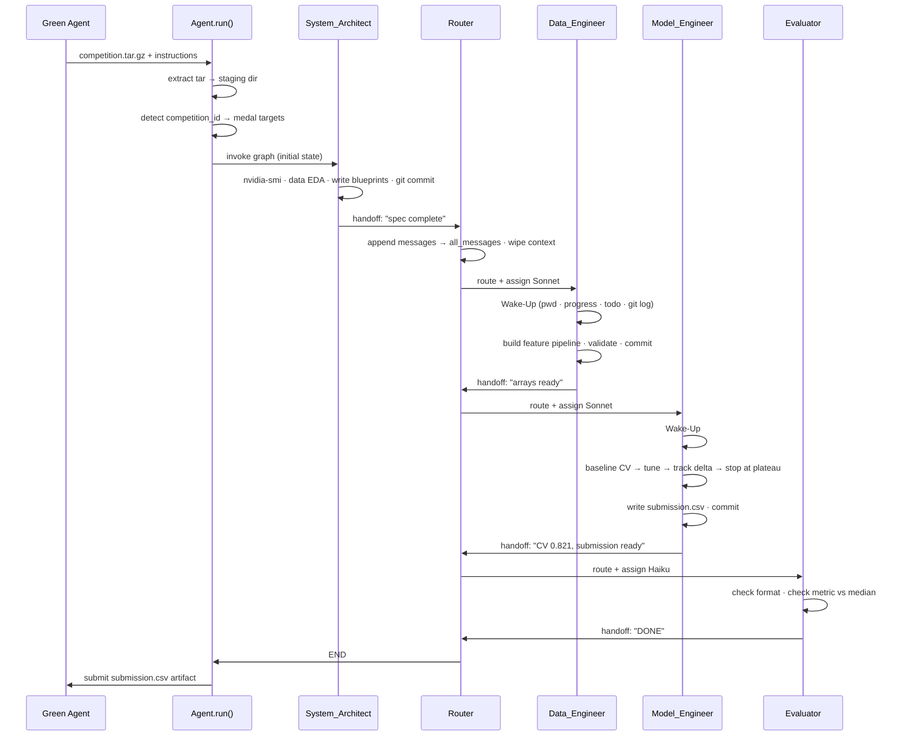
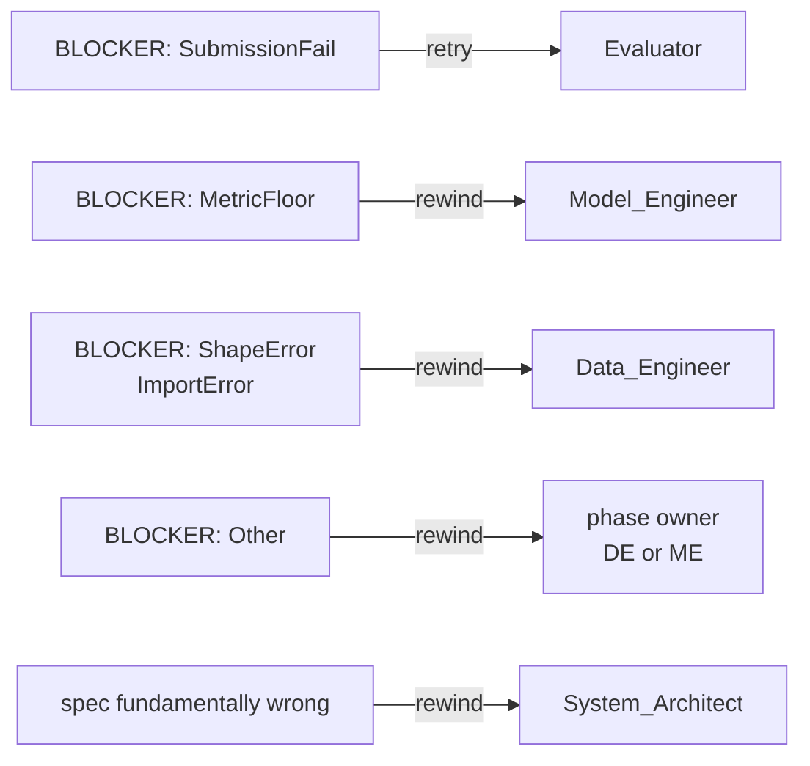

# MLE Agent

## TL;DR

MLE Agent approaches each ML problem EXACTLY the way a real [MLE] (team) would: an Architect reads the problem and designs the pipeline, a Data Engineer builds the features, a Model Engineer trains and iterates, and an Evaluator does sanity checks on the final submission. Each specialist is equipped with sandboxed tools and carries domain-specific ML instincts without assuming fixed solutions — the pipeline adapts to the problem. Above all, a manager (router) coordinates — deciding who's next to work, assigning time and cost budget (Opus vs Sonnet vs Haiku), and pushing back to prior stages if the team is on a wrong route (triggering rewinds). All coordinated through a LangGraph cyclic graph that enables dynamic phase transitions.

The core design challenge mirrors how real [MLE] teams stay aligned across long projects: every agent writes its work to disk — cross-referenced architectural blueprints, task checklists, progress handovers, execution logs — in a git-versioned workspace any agent can audit on re-entry. When the context window compacts between phases, agents re-orient from persistent memory hierarchy rather than losing context. This makes the system robust on complex, multi-phase problems that need long runs. 

Cost-performance balance is a first-class concern: hard iteration caps and prompted ML instincts actively discourage over-optimizing on validation — compute is spent where it generalizes, not where it overfits. A post-run LLM-as-a-judge evaluation is also implemented to enable systematic improvement across competition runs. 

We evaluated across a diverse set of competitions spanning differnt categories and difficulties, showing competitive scores and validating the robustness of this agent design. Full benchmark results are tracked in the README.md.

---

## Architecture

### Agent Graph

```
                         ┌─────────────────────────────────┐
                         │                                 │
                         ▼                                 │  rewind
              ┌─────────────────────┐                     │  (spec wrong)
   START ───► │   System_Architect  │                     │
              │   Opus · Planning   │                     │
              └──────────┬──────────┘                     │
                         │                                 │
                         ▼                                 │
              ┌─────────────────────┐                     │
         ┌───►│    Router_Brain     │◄────────────────────┘
         │    │  Haiku · Manager   │
         │    └──┬────┬────┬───────┘
         │       │    │    │
         │  ┌────┘    │    └────────┐
         │  │         │             │
         │  ▼         ▼             ▼
         │  ┌──────┐  ┌──────────┐  ┌───────────┐
         │  │  DE  │  │    ME    │  │    EV     │
         │  │Sonnet│  │ Sonnet   │  │  Haiku    │
         │  │ Data │  │  Model   │  │ Evaluate  │
         │  └──┬───┘  └────┬─────┘  └─────┬─────┘
         │     │           │              │
         └─────┴───────────┘              │
                  back to Router          │
                                          ▼
                                        END
```

### Node Roles

| Node | Model | Responsibility |
|---|---|---|
| **System_Architect** | Opus | Reads competition description, runs data discovery, writes blueprint (`ml_rules.md`, `ml_spec.md`, `ml_todo.md`) |
| **Router_Brain** | Haiku | Reads progress, decides next node, assigns model tier, triggers rewinds on typed blockers |
| **Data_Engineer** | Sonnet | Feature engineering, preprocessing pipeline, produces validated arrays |
| **Model_Engineer** | Sonnet | Model training, CV-guided iteration, hyperparameter tuning, generates `submission.csv` |
| **Evaluator** | Haiku | Submission format validation, metric sanity check, gates final submit |

---

## Agent Flow

### Full Competition Run



### Rewind Logic



---

## Memory & Context System

Each competition run gets an **isolated, git-versioned workspace**. Agents communicate not through shared memory but through files — the same way a real team uses shared docs and version control.

### The Memory Hierarchy

```
workspace/
├── ml_rules.md          ← loaded into EVERY node's system prompt each loop
│                           competition rules, I/O paths, medal targets, constraints
├── ml_spec.md           ← cold storage blueprint (read only when cross-referenced)
│                           architecture decisions, model choice, validation strategy
├── ml_todo.md           ← active task checklist with spec cross-references
│                           [x] completed  [ ] pending  → guides each node's work
├── ml_progress.txt      ← shift handover scratchpad (overwritten each Sign-Off)
│                           Current State · Blockers · Next Steps · Key Findings
├── logs/
│   ├── metrics.txt      ← all CV scores, per-fold results, hyperparameters logged here
│   ├── bash_history.log ← every Python script run and its output (Python + errors only)
│   └── all_messages.jsonl ← full LLM trace, one JSON line per tool round
│                             → feeds post-run LLM-as-a-judge evaluation
└── .git/                ← each node shift = one commit; `git log` is the audit trail
```

### Why This Works

- **Context resets are by design.** The Router wipes active message history on every phase transition. This prevents stale reasoning from bleeding across phases.
- **Files replace memory.** Every agent starts with a Wake-Up protocol: `pwd && ls` → `read ml_progress.txt` → `read ml_todo.md` → `git log`. Within 3 tool calls, any node has full context.
- **Cold storage prevents bloat.** `ml_spec.md` is only read when a task explicitly references it (`Ref: ml_spec.md → Section 2.1`). A long spec doesn't load on every iteration.
- **Git = truth.** If an agent claims it completed a task but didn't commit, the next node sees uncommitted files in `git status` and knows not to trust the claim.

---

## Repository Structure

```
mle_agent/
├── src/
│   ├── agent.py              # Entry point: unpack tar, init graph, submit artifact
│   ├── graph.py              # LangGraph StateGraph: nodes, edges, conditional routing
│   ├── nodes.py              # Node implementations: ReAct loop, Architect, Router
│   ├── state.py              # AgentState TypedDict (LangGraph shared state)
│   ├── llm.py                # Tiered LLM dispatch (Opus / Sonnet / Haiku)
│   ├── tools.py              # Tool implementations + Anthropic schemas
│   ├── tool_node.py          # Universal tool dispatcher
│   ├── prompts.py            # Prompt loader + assembly (static + protocols + ml_rules)
│   ├── medal_thresholds.py   # Pre-computed medal scores for all 82 competitions
│   ├── executor.py           # A2A task lifecycle
│   └── server.py             # A2A HTTP server entry point
├── prompts/
│   ├── nodes/                # Static system prompt per node
│   │   ├── architect.md
│   │   ├── router.md
│   │   ├── data_engineer.md
│   │   ├── model_engineer.md
│   │   └── evaluator.md
│   ├── protocols/
│   │   ├── wake_up.md        # pwd · progress · todo · git log
│   │   └── sign_off.md       # update todo · write progress · commit · handoff
│   └── dynamic/
│       └── ml_rules_template.md  # Architect fills this per competition
├── specs/                    # Design specifications (cold storage)
├── Dockerfile
├── amber-manifest.json5      # AgentBeats deployment config
└── pyproject.toml
```


---

## Results

| Competition | Category | Score | Gold threshold | Medal | Run time |
|---|---|---|---|---|---|
| spaceship-titanic | Tabular classification | 0.799 | 0.821 | Above median | ~67 min |
| aerial-cactus-identification | Image classification | 0.9989 | 0.9990 | 🥈 Silver | ~19 min |

*Benchmarking ongoing across competition categories and difficulty levels. Per-fold CV breakdowns and training traces are in each workspace's `logs/` directory.*

---

## Design Decisions

### Why multi-agent over single-shot / tree-search?

Tree-search approaches win by sampling many independent solutions and keeping the best. This works well on simple problems where the full solution fits in one script. It breaks down on complex problems requiring multi-stage pipelines — a specialist agent can build 300 lines of well-tested preprocessing code that a single-script generator would rush. Our approach trades sampling breadth for reasoning depth: each specialist builds on the prior's artifacts, with the option to rewind rather than restart entirely.

### Why file-based memory over in-context state?

LangGraph state is wiped by the Router on each phase transition — intentionally. Keeping 50 tool rounds of model training conversation in context when the Evaluator just needs to check a CSV format is wasteful and noisy. Files are the shared medium: `ml_progress.txt` is a 10-line handover note, not a transcript. `ml_todo.md` tells the next agent exactly what's done. `git log` is an immutable audit trail. Any agent can re-orient from scratch in 3 tool calls.

### Why tiered model dispatch?

- **Opus** for architecture: a bad spec cascades into every downstream node. One wrong design decision costs more in rewinds than Opus costs per call.
- **Sonnet** for execution: writing and debugging code is Sonnet's strength. Long ReAct loops with Haiku would produce worse code requiring more debug rounds.
- **Haiku** for routing and evaluation: JSON routing decisions and CSV format checks don't require strong reasoning. Haiku handles both reliably at a fraction of the cost.

### Why CV-primary, plateau-based stopping?

A single holdout split has ±1-2% variance. Optimizing Optuna against the same holdout for 100 trials fits that split's noise, not the signal — we observed this directly: validation 0.824 → test 0.799 (2.5% gap). The fix: CV as the primary signal, stop when `|Δ| / |best| < 0.3%` for two consecutive attempts. This threshold maps to the noise floor of 5-fold CV and is metric-agnostic.
